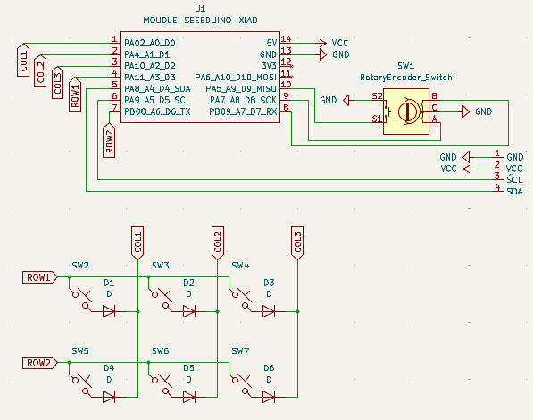
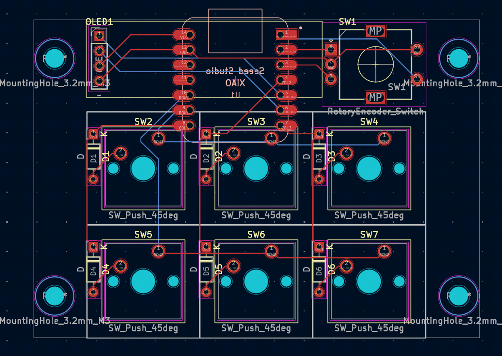
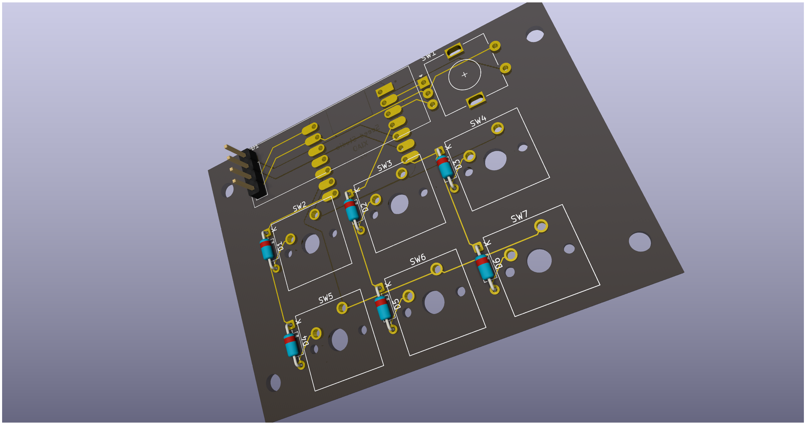
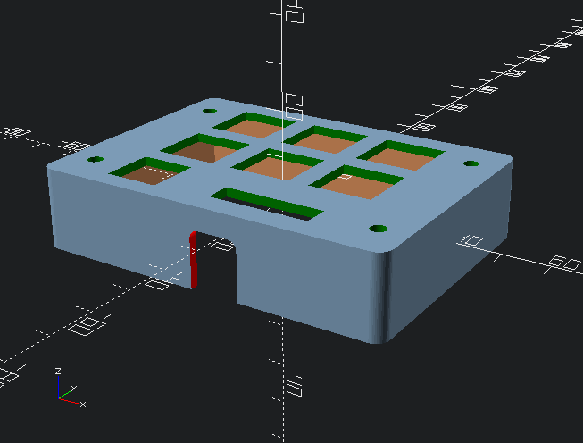

# sixpad
Sixpad is a simple macropad with six switches, rotary encoder and a OLED display

## Features
- 128x32 OLED Display
- EC11 Rotary encoder
- 6 Keys
- RP2040
- VIAL support

## PCB
- designed using KiCAD

## Case
- designed using openSCAD

The case is only one part, as the PCB will be put in place through the bottom hole and held there by 4x M3 nuts and screws.

## Firmware
- uses QMK firmware
- supports vial (even rotary encoder)
- OLED display displays what layer you are on

## BOM
- 6x Cherry MX Switches
- 6x DSA Keycaps
- 4x M3x16mm SHCS Bolts
- 4x M3 Nuts
- 6x 1N4148 DO-35 Diodes.
- 1x 0.91" 128x32 OLED Display
- 1x EC11 Rotary Encoder
- 1x XIAO RP2040
- 1x Case
